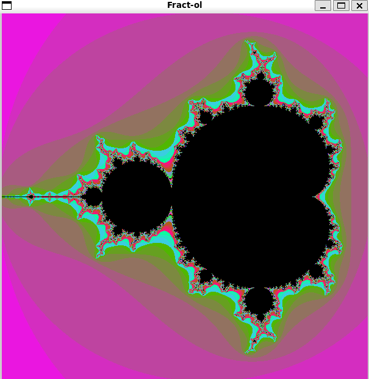

# Fract-ol

<p align="center">
  
</p>

## About

**Fract-ol** is a real-time fractal visualization program developed as part of the 42 School curriculum. This project explores the mathematical beauty of fractals through interactive rendering using the **[MiniLibX](https://harm-smits.github.io/42docs/libs/minilibx)** graphics library.

The program implements three distinct fractal sets with full mouse and keyboard navigation, allowing users to explore infinite mathematical complexity in stunning detail.

> **MiniLibX** is a simple graphics library provided by 42 School for creating graphical applications. It provides basic window management, image manipulation, and event handling. [Learn more about MiniLibX](https://harm-smits.github.io/42docs/libs/minilibx).


## What is a Fractal?

A **fractal** is a mathematical set that exhibits self-similarity at different scales. When you zoom into a fractal, you discover similar patterns repeating infinitely. Fractals are defined by iterative mathematical formulas where complex numbers are repeatedly transformed.

### Implemented Fractals:

#### **Mandelbrot Set**
The Mandelbrot set is defined by the iterative formula:
```
z(n+1) = z(n)² + c
```
**Mathematical explanation:**
- `z` is a complex number that starts at **z₀ = 0**
- `c` is the **complex coordinate** of each pixel (c = x + yi)
- For each iteration: calculate z² then add c
- **Complex multiplication**: (a + bi)² = (a² - b²) + 2abi

**Coloring logic:**
- If |z| remains ≤ 2 after maximum iterations → point is **in the set** (black)
- If |z| > 2 → point **escapes to infinity**, colored by iteration count (speed of divergence)

#### **Julia Set**
Julia sets use the same formula as Mandelbrot:
```
z(n+1) = z(n)² + c
```
**Key difference from Mandelbrot:**
- `c` is a **fixed complex constant** (same for all pixels)
- `z` **starts at the pixel's coordinate** (z₀ = pixel position)
- Each different `c` value creates a **completely different** Julia set

**Example:**
- c = -0.7 + 0.27i → creates a classic "dendrite" Julia set
- c = 0.285 + 0.01i → produces a "Douady rabbit" fractal
- Interactive controls (Q/W/A/S) let you explore different c values in real-time

#### **Burning Ship**
A variation of the Mandelbrot set using absolute values:
```
z(n+1) = (|Re(z)| + i|Im(z)|)² + c
```
**Mathematical breakdown:**
- Before squaring, take the **absolute value** of both real and imaginary parts
- If z = a + bi, then |Re(z)| + i|Im(z)| = |a| + i|b|
- This breaks the symmetry of the Mandelbrot set

**Visual result:**
- Creates sharp, angular features instead of smooth curves
- Produces an asymmetric pattern (not mirrored on the x-axis)
- Named for its resemblance to a ship engulfed in flames


## Features

- **Three fractal types**: Mandelbrot, Julia, and Burning Ship
- **Real-time rendering** with optimized calculations
- **Interactive navigation**:
  - Infinite zoom capability
  - Pan in any direction
  - Dynamic iteration adjustment
- **Julia set parameter control** for live morphing
- **Randomized color palettes** for unique visualizations
- **Smooth window management** with proper event handling
- **Memory-safe**: No memory leaks, proper cleanup on exit


## Installation

### Prerequisites
- **Linux** operating system
- **gcc** compiler
- **Make**
- **X11 development libraries** (libX11, libXext)
- **MiniLibX** (included in the repository)

### Build
```bash
git clone https://github.com/noanjrd/42_fract-ol
cd 42_fract-ol
make
```

This will compile the program and generate the `fractol` executable.


## Usage

Run the program by specifying the desired fractal type:

```bash
./fractol [fractal_name]
```

### Available Fractals:
```bash
./fractol Mandelbrot      # Displays the Mandelbrot set
./fractol Julia           # Displays a Julia set
./fractol Burning_ship    # Displays the Burning Ship fractal
```

### Invalid input:
Running the program without arguments or with invalid parameters displays usage instructions.

## Controls

| Control | Action |
|---------|--------|
| **Mouse Wheel Up/Down** | Zoom in / Zoom out |
| **Arrow Keys** (↑ ↓ ← →) | Move the view |
| **I** | Increase iteration depth (more detail) |
| **Q / W** | Adjust Julia `c_re` parameter (real part) |
| **A / S** | Adjust Julia `c_i` parameter (imaginary part) |
| **ESC** / Close button | Exit program 

## Technical Details

### Structure: `t_fractal`

The main structure contains all parameters needed for fractal rendering:

```c
typedef struct t_fractal
{
    void    *mlx;              // MLX connection pointer
    void    *win;              // Window pointer
    void    *img;              // Image pointer
    void    *addr;             // Image buffer address
    int     number;            // Fractal type identifier
    int     bits_per_pixel;    // Image format (bits)
    int     line_length;       // Image line length
    int     endian;            // Byte order
    double  zoom;              // Zoom level
    double  start_x;           // X offset (pan)
    double  start_y;           // Y offset (pan)
    double  c_re;              // Julia constant (real part)
    double  c_i;               // Julia constant (imaginary part)
    int     *adress;           // Color multiplier pointer
    int     iteration;         // Maximum iteration count
    double  z_x;               // Current complex x coordinate
    double  z_y;               // Current complex y coordinate
    double  scale;             // Pixel-to-complex conversion factor
}           t_fractal;
```

### Key Parameters Explained:

- **`zoom`**: Controls the magnification level. Higher values = deeper zoom.
- **`start_x`, `start_y`**: Offset coordinates for panning across the fractal.
- **`c_re`, `c_i`**: Complex constant for Julia sets. Modifying these values transforms the Julia set shape.
- **`iteration`**: Maximum number of iterations before considering a point part of the set. Higher values reveal finer details but increase computation time.
- **`scale`**: Converts pixel coordinates to complex plane coordinates based on zoom level.
- **`z_x`, `z_y`**: Current complex coordinates being calculated.
- **`adress`**: Pointer to color multiplier for generating varied color schemes.

### Window Settings:
- **Resolution**: 600×600 pixels (defined by `WINDOW_WIDTH` and `WINDOW_HEIGHT`)
- **Rendering**: Direct pixel manipulation using MLX image buffer


## Gallery

### Julia Set
<p align="center">
  
</p>

### Mandelbrot Set
<p align="center">
  
</p>

### Burning Ship
<p align="center">
  
</p>

## License

This project is part of the 42 School curriculum and follows the school's academic policies.
